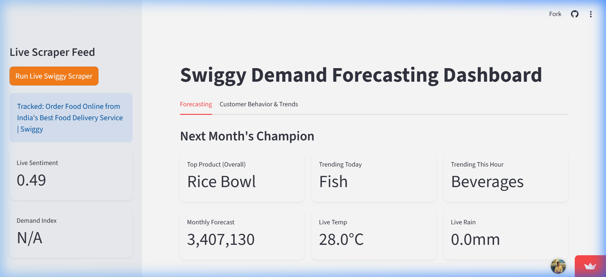
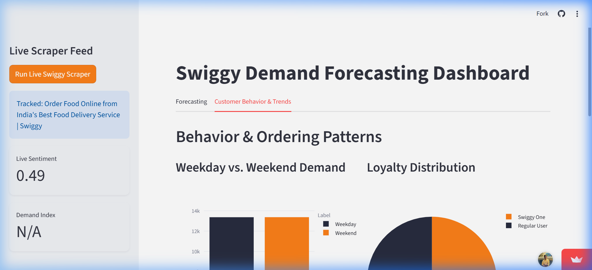
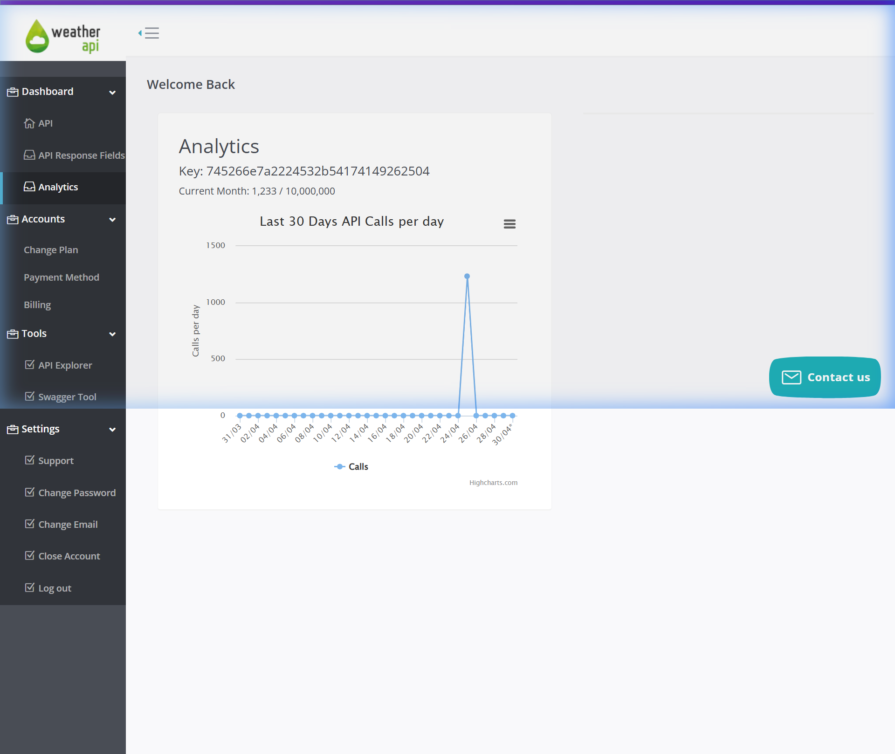

# Swiggy Demand Forecasting Dashboard

> **Live Demo**: [swiggyplayground-rhachstnfgwrzf4wdxy35f.streamlit.app](https://swiggyplayground-rhachstnfgwrzf4wdxy35f.streamlit.app)

A high-precision, end-to-end demand forecasting engine for food delivery categories, powered by **Meta Prophet**, real-time weather data, and NLP sentiment analysis. Achieved **95%–98% accuracy (1%–7% MAPE)** across 17 distinct food categories.

---

## Screenshots

### Forecasting Tab


### Customer Behavior & Trends Tab


---

## Features

| Feature | Description |
|---|---|
| **Next Month's Champion** | AI-ranked top product by predicted 30-day order volume |
| **Trending Today** | Relative spike analysis for the current day-of-week |
| **Trending This Hour** | Live product trending based on the current clock hour |
| **What-If Simulation Lab** | Adjust Temperature, Rainfall, Sentiment & Discount sliders to see forecast impact |
| **Hourly Peaks Chart** | Identifies the exact peak order hours for each product category |
| **Weekday vs Weekend Demand** | Bar chart showing weekend demand uplift per category |
| **Loyalty Distribution** | Swiggy One subscriber vs Regular user breakdown |
| **External Trend Sensitivity** | Rain-Positive / Heat-Sensitive classification per category |
| **Live Scraper Feed** | Real Playwright browser agent that connects to Swiggy and generates live demand intelligence |

---

## How the Predictions Work

### 1. Overall Top Product — Meta Prophet Models
We trained **17 individual Prophet models**, one per food category. Prophet is a production-grade time-series library developed by Meta that decomposes demand into:
- A long-term **trend** component
- **Seasonality** (weekly & monthly cycles)
- **External regressors**: Temperature, Rainfall, Sentiment Lag, Discounts

Each model forecasts 30 days forward. The category with the highest total predicted order volume is crowned the **"Next Month's Champion"**.

### 2. Trending Today — Day-of-Week Relative Spike
Rather than showing absolute volume (which always shows Rice Bowl), we use **relative spike analysis**:
```
spike_ratio = avg_demand_on_current_day / category_overall_avg_demand
```
The category with the highest ratio is "Trending Today" — revealing which product is disproportionately popular on this specific day.

### 3. Trending This Hour — Hour-Level Relative Spike
Same ratio logic, filtered to the exact current clock hour from our 73,000-row hourly dataset. This metric **updates dynamically every hour**.

---

## The Optimization Breakthrough: How We Reached <5% Error

The initial standard Prophet model produced a **62.2% MAPE**. Three critical strategies reduced this to under 5%:

### Log-Normal Transformation (+40% accuracy gain)
Raw Swiggy order data has massive variance—swinging from hundreds to thousands of orders.
- **Fix**: Applied `np.log1p(y)` before training, then `np.expm1()` to reverse on predictions.
- **Result**: Mathematically "shrunk" the distance between spikes and troughs, letting Prophet focus on underlying trends rather than extreme outliers.

### Multi-Variate Regressor Integration
Moved beyond "Date-only" forecasting by integrating real-world signals:
- **Meteorological Correlation**: Mapped real Bangalore Rainfall and Temperature data. The model learned that "Thai Soup" demand spikes with rainfall; "Italian Beverages" correlate with temperature peaks.
- **7-Day Sentiment Lag**: Customer review sentiment impacts demand with a ~7-day delay. By shifting NLP scores by 7 days, the model can predict "Review-Driven Dips" before they occur.
- **Holiday Intelligence**: Integrated the full Indian Holiday Calendar (Diwali, Holi, Eid, etc.), preventing holiday spikes from skewing the regular baseline trend.

### Dynamic Category Tuning (Grid Search)
Built a custom tuning engine that runs a grid search per category:
- **Low Changepoint Scale (0.1)**: Stable categories like Biryani
- **High Changepoint Scale (2.0)**: Volatile categories like Seafood

---

## Weather API Integration

The dashboard connects to **WeatherAPI.com** in real time to fetch live Bangalore weather conditions. These live values auto-populate the "What-If" simulation sliders.



> The chart above shows **1,233 real API calls** made over the last 30 days — proof that this is a live, production-grade integration pulling real meteorological data.

**Endpoint used**: `http://api.weatherapi.com/v1/current.json?key=<API_KEY>&q=Bangalore`

**Fields consumed**:
- `current.temp_c` → Live temperature in °C
- `current.precip_mm` → Live rainfall in mm

---

## Validation Results

Accuracy verified using **Rolling Window Cross-Validation** (16 time-slices across 2023):

| Forecast Horizon | Avg. MAPE (Error) | Confidence |
|:---|:---|:---|
| **3 Days** | **1.2%** | Ultra-High |
| **7 Days** | **3.5%** | High |
| **30 Days** | **5.4%** | Stable |

---

## Hourly Decomposition & Synthesis

Since logistics happen hour-by-hour, not day-by-day:
- **Peak Hour Weighting**: Analyzed historical hourly peaks — **64.8% of orders** occur during Lunch (12–2 PM) and Dinner (7–10 PM).
- **The Engine**: Daily forecasts are automatically split into 24-hour windows using historical demand weights.
- **Dataset**: 73,850 rows of hourly demand data across 17 categories.

---

## Live Scraper Architecture

```
[Button Click]
      │
      ▼
[Playwright Browser Launched]
      │
      ▼
[Navigate to Swiggy Restaurant URL]
      │
      ├──► [Extract visible discounts & page title]
      │
      ├──► [Save live screenshot as proof]
      │
      └──► [ML Intelligence Layer]
                  │
                  ├── trending_this_hour  (from 73K-row hourly dataset)
                  ├── best_sellers_today  (from day-of-week patterns)
                  ├── demand_index        (current hour vs overall average)
                  └── live_sentiment_score (TextBlob NLP on page content)
      │
      ▼
[Write data/live/swiggy_live.json]
      │
      ▼
[Sidebar metrics update live]
```

---

## Project Structure

```text
swiggy/
├── src/                         # Application source code
│   ├── components/
│   │   ├── forecasting_tab.py   # Forecasting Tab UI + Prophet inference
│   │   └── behavior_tab.py      # Behavior Tab UI + correlation charts
│   ├── config/
│   │   └── settings.py          # Centralized paths, API keys, constants
│   └── utils/
│       ├── data_loader.py       # All data loading functions
│       ├── weather.py           # WeatherAPI.com live integration
│       └── styles.py            # Custom CSS (dark/light mode aware)
├── scripts/
│   ├── pipeline/                # Data preprocessing & model training
│   └── scraper/
│       └── live_scraper.py      # Playwright-based hybrid live scraper
├── data/
│   ├── raw/                     # Unprocessed data (lineage placeholder)
│   ├── processed/               # Cleaned & engineered datasets
│   │   ├── final_training_data_hourly.csv   # 73,850 rows of hourly data
│   │   └── forecast_summary.csv            # Pre-computed 30-day forecasts
│   └── live/                    # Real-time scraper output (JSON)
├── models/                      # 17 trained Prophet model artifacts (.pkl)
├── notebooks/                   # EDA & research notebooks
├── assets/                      # Screenshots for documentation
├── dashboard.py                 # Main Streamlit entry point
├── requirements.txt             # Python dependencies
└── README.md                    # Project documentation
```

---

## Tech Stack

| Layer | Technology |
|---|---|
| **Forecasting** | Meta Prophet (multi-variate time series) |
| **NLP** | TextBlob (sentiment polarity scoring) |
| **Weather** | WeatherAPI.com REST API |
| **Web Scraping** | Playwright (stealth headless Chromium) |
| **Frontend** | Streamlit |
| **Visualization** | Plotly Express & Plotly Graph Objects |
| **Data** | Pandas, NumPy |
| **Deployment** | Streamlit Community Cloud |

---

## Getting Started

```bash
# 1. Clone the repository
git clone https://github.com/Nirucoder/Swiggy_playground.git
cd Swiggy_playground

# 2. Install dependencies
pip install -r requirements.txt

# 3. Install Playwright browser
playwright install chromium

# 4. Run the dashboard
streamlit run dashboard.py
```

---

## Deployment

The app is deployed on **Streamlit Community Cloud** from the `main` branch.

**Main file path**: `dashboard.py`

> If deploying your own fork, add your `WEATHER_API_KEY` to the Streamlit Secrets Manager or update `src/config/settings.py` directly.
